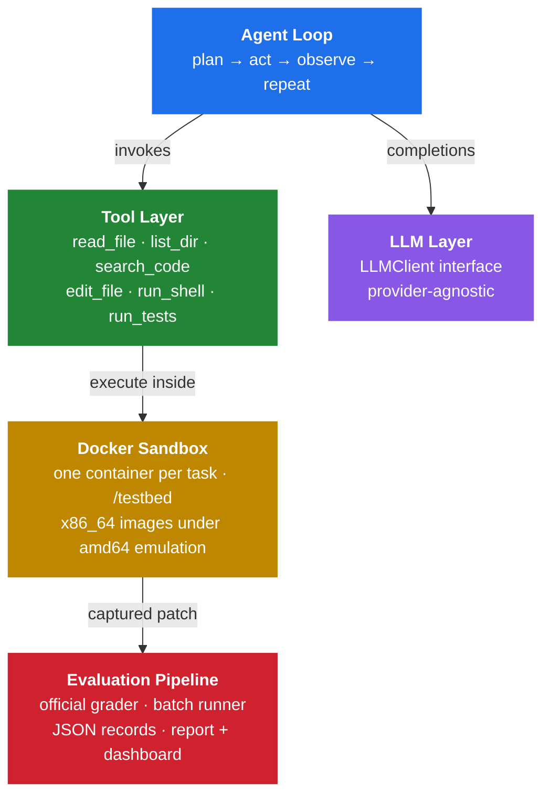
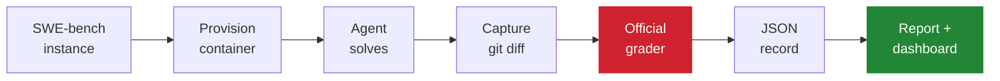

<div align="center">

# Autonomous Issue Resolver

**An autonomous coding agent that resolves real GitHub issues — evaluated with the official SWE-bench harness.**

[](https://github.com/aryanranade/autonomous-issue-resolver/actions/workflows/ci.yml)
[](https://www.python.org/downloads/)
[](https://www.docker.com/)
[](tests/)
[](https://mypy-lang.org/)
[](LICENSE)

[](https://www.swebench.com/)
[](https://huggingface.co/datasets/princeton-nlp/SWE-bench_Lite)

</div>

---

## Overview

Given a real GitHub issue and the repository it belongs to, this agent plans a fix, navigates the codebase, edits source files, runs the project's test suite, and produces a patch — autonomously, inside an isolated Docker container.

The patch is then graded by **SWE-bench's own evaluation harness**, using the same hidden tests and the same pass/fail criteria as the public leaderboard. Correctness is not self-reported.

The system is deliberately built around a **provider-agnostic LLM interface**: switching between Groq, Google Gemini, OpenAI, OpenRouter, DeepSeek, or a locally hosted model is a configuration edit, not a code change.

### Highlights

| | |
|---|---|
| **Official grading** | Patches are scored with swebench's `eval_script` and report parser — not a bespoke checker |
| **Real isolation** | Every task runs in its own SWE-bench container; the agent edits a bind-mounted checkout at `/testbed` |
| **Provider-agnostic** | One `LLMClient` interface; providers swap via `config.toml` with zero code changes |
| **Repo-aware testing** | Uses each project's real test runner — `pytest`, `runtests.py`, `bin/test`, or `tox` |
| **Resumable batches** | Quota-aware sweeps that survive interruption and continue where they stopped |
| **Failure analysis** | Every unresolved instance is classified into a specific failure mode |
| **Zero-cost validation** | The grading pipeline can be verified end to end without spending a single token |

---

## Architecture



Nothing above the LLM layer knows which provider is in use. The agent depends only on the `LLMClient` interface and a small set of neutral dataclasses (`Message`, `ToolSpec`, `ToolCall`, `LLMResponse`), which is what makes provider swapping a configuration concern rather than an engineering one.

### Evaluation pipeline



Grading deliberately runs in a **fresh container**, independent of the one the agent worked in, so a score depends only on the captured patch — never on residual state the agent left behind.

---

## Quick Start

### Prerequisites

- Python 3.11 or newer
- Docker (Desktop, colima, or any daemon)
- An API key for any OpenAI-compatible provider

### Installation

```bash
git clone https://github.com/aryanranade/autonomous-issue-resolver.git
cd autonomous-issue-resolver

python3 -m venv .venv && source .venv/bin/activate
pip install -e ".[dev]"
```

### Configuration

```bash
cp .env.example .env     # add one API key — whichever provider config.toml names
```

API keys never enter the repository. `config.toml` stores only the *name* of the environment variable holding the key; the value is read from the environment (or a gitignored `.env`), and `LLMConfig.__repr__` masks it in logs and tracebacks.

### Verify the installation

```bash
pytest                                       # 131 tests, no API key required
python scripts/smoke_test.py --stage free    # end-to-end pipeline check, 0 tokens
```

The `--stage free` check is the recommended first command. It costs nothing and is explained under [Validation](#validation).

---

## Usage

### Solve and grade a single instance

```bash
python -m swe_agent.eval.cli --instance-id pallets__flask-4045 --max-steps 20
```

Streams the agent's reasoning and tool calls live, then prints the official grade. Add `--results-dir runs/lite` to persist a JSON record.

### Run a batch

```bash
python -m swe_agent.eval.batch_cli --limit 30 --results-dir runs/lite --open
```

Writes one record per instance and regenerates the HTML dashboard. Re-running **resumes**: already-graded instances are skipped, and a sweep interrupted by a rate limit or quota exhaustion picks up exactly where it left off.

### Generate the report

```bash
python -m swe_agent.eval.analyze_cli --results-dir runs/lite \
    --out runs/lite/report.md --html runs/lite/dashboard.html
```

Requires neither an API key nor Docker. Every instance is classified into one outcome:

`resolved` · `regression` · `incomplete_fix` · `no_patch` · `patch_apply_failed` · `eval_incomplete` · `llm_error` · `run_error`

The dashboard is a **self-contained HTML file** — inline CSS and JS, data embedded, no server and no external requests — with a resolve-rate headline, an outcome breakdown, a per-repository table, and expandable rows showing each run's diagnosis, tool trace, per-test results, and diff.

### Run against any local repository

```bash
python -m swe_agent.agent.cli --repo ./path/to/repo \
    --issue "subtract(5, 3) returns 8 but should return 2"
```

> [!NOTE]
> This mode executes commands on the host without a sandbox. It is intended for quick local use; the graded SWE-bench path above is fully containerized.

---

## Provider Configuration

Any OpenAI-compatible endpoint works through the same client. Only `config.toml` changes.

```toml
[llm]
provider    = "openai"                      # groq | gemini | openai
model       = "gpt-4o-mini"
base_url    = "https://api.openai.com/v1"
api_key_env = "OPENAI_API_KEY"
# temperature = 0.0                         # omit for providers that reject sampling params
```

| Provider | `provider` | Notes |
|---|---|---|
| Groq | `groq` | Default. Free tier available |
| Google Gemini | `gemini` | Via Gemini's OpenAI-compatible endpoint |
| OpenAI | `openai` | Also covers OpenRouter, DeepSeek, Together, vLLM, Ollama |
| Anthropic | — | Not OpenAI-compatible; see below |

**Sampling parameters.** `temperature` is transmitted only when present in `config.toml`. Some providers — current Anthropic models among them — reject sampling parameters with a `400`, so the key must be absent rather than defaulted. Comment it out for those providers.

**Anthropic** is intentionally not aliased to the generic client, because its API is not OpenAI-compatible. Setting `provider = "anthropic"` fails immediately with an explanatory error rather than breaking mid-run. Adding support means implementing `LLMClient` in `src/swe_agent/llm/` and registering it in `factory.py`; nothing above the LLM layer changes.

Misconfiguration is caught at startup by every CLI, which prints a single-line diagnostic and exits `2` — no traceback, no partially executed run.

---

## Validation

Correctness of the grading pipeline is verified **without spending any tokens**, by exploiting a property of the dataset: every SWE-bench instance ships its own *gold* patch. Grading that patch must produce `RESOLVED_FULL`. If it does not, the harness is wrong and every score it produces is meaningless.

```bash
python scripts/smoke_test.py --stage free
```

| Stage | LLM cost | What it proves |
|---|---|---|
| `grade-gold` | none | Dataset loading, container provisioning, amd64 emulation, official `eval_script`, log parsing, resolution status |
| `grade-empty` | none | The no-diff short circuit (negative control) |
| `agent` | small | Model reachability, in-container tool execution, patch capture — and reports measured token cost per step |

This has been executed across all four test-runner families in SWE-bench Lite — django, sympy, sphinx, and flask — with every gold patch scoring `RESOLVED_FULL`, alongside verification of image auto-pull, container cleanup, and batch resume.

---

## Engineering Notes

Details that were non-obvious and materially affected correctness.

<details>
<summary><b>Only 31% of SWE-bench Lite uses pytest</b></summary>

<br>

The agent's `run_tests` tool originally assumed `pytest`. In reality:

| Runner | Instances | Share |
|---|---:|---:|
| `./tests/runtests.py` (django) | 114 | 38% |
| `bin/test` (sympy) | 77 | 26% |
| `pytest` | 93 | 31% |
| `tox` (sphinx) | 16 | 5% |

Assuming pytest silently disabled the agent's ability to verify its own fix or detect regressions on **69% of the benchmark** — without ever failing loudly, since grading uses swebench's own script. The tool now derives its command from swebench's repo/version table, the same source the official grader reads, so the agent tests exactly the way it will be graded.

</details>

<details>
<summary><b>Running x86_64-only images on Apple Silicon</b></summary>

<br>

SWE-bench publishes prebuilt instance images for `x86_64` only. On arm64 hosts they run under emulation via `--platform linux/amd64`. Correct, though slower — and the reason grading times are dominated by test execution rather than model latency.

</details>

<details>
<summary><b>Preserving the editable install across a bind mount</b></summary>

<br>

The agent needs host-side file edits and in-container test runs to share a filesystem. A naive bind mount over `/testbed` would shadow the image's contents and break the `pip install -e .` baked into the image.

The environment instead copies `/testbed` out of the image via a throwaway container, then bind-mounts it back **at the same path** — so the editable install stays valid while edits and test runs share files.

</details>

<details>
<summary><b>The eval script's markers are on stderr</b></summary>

<br>

swebench's `eval_script` delimits results with `>>>>> Start Test Output` markers emitted by bash's `set -x` trace — which writes to **stderr** — while pytest writes results to **stdout**. Capturing the streams separately interleaves them incorrectly and the report parser silently finds nothing.

The script must be run as `/bin/bash /eval.sh 2>&1` so the streams merge in order.

</details>

<details>
<summary><b>Transcript compaction</b></summary>

<br>

An agent loop re-sends its entire transcript on every step, so token cost grows quadratically with step count. Before each request the loop elides the content of all but the *N* most recent tool results (`keep_recent_tool_results`), preserving assistant/tool message pairing and retaining the full transcript in the saved record.

This roughly halves token use on long runs, directly increasing how many instances a fixed budget covers.

</details>

<details>
<summary><b>Rate-limit handling</b></summary>

<br>

Agent loops are bursty — a single task can require 10–30 model calls. Three mitigations:

1. **Inter-call delay** (`delay_between_calls_s`) eases requests-per-minute pressure.
2. **Two retry layers** — the `openai` SDK retries first, honouring `Retry-After`; `utils/retry.py` is the outer exponential-backoff net. Auth and bad-request `4xx` responses are never retried.
3. **Graceful exhaustion** — when retries are spent, the loop ends with `StopReason.ERROR`, preserves any partial patch, and the batch aborts cleanly rather than crashing.

</details>

---

## Project Structure

```
src/swe_agent/
├── config.py              # config.toml + environment-sourced API key
├── dataset.py             # SWE-bench Lite loading
├── task.py                # the unit of work
├── llm/
│   ├── base.py            # provider-neutral interface and dataclasses
│   ├── groq_client.py     # the only module aware of OpenAI wire format
│   └── factory.py         # build_llm_client() — single switch point
├── tools/                 # agent tools + CommandExecutor seam
├── agent/
│   ├── loop.py            # plan → act → observe
│   ├── compaction.py      # transcript compaction
│   └── cli.py             # run against a local repository
├── sandbox/
│   ├── docker.py          # DockerSandbox + DockerExecutor
│   └── environment.py     # per-instance SWE-bench provisioning
├── eval/
│   ├── grading.py         # official grading
│   ├── runner.py          # solve_and_grade(): one instance end to end
│   ├── batch.py           # resumable, quota-aware sweeps
│   ├── analysis.py        # outcome classification
│   ├── dashboard.py       # self-contained HTML report
│   └── *_cli.py           # command-line entry points
└── utils/retry.py         # exponential backoff
```

---

## Development

```bash
pytest                  # full suite; Docker tests skip without a daemon
mypy                    # strict type checking across src/ and scripts/
```

Continuous integration runs `mypy --strict` and the full test suite on Python 3.11 and 3.12 for every push and pull request.

### Dependencies

Deliberately minimal, with each inclusion justified.

| Package | Purpose |
|---|---|
| `openai` | OpenAI-compatible HTTP client; robust tool-call serialization and `Retry-After` handling |
| `python-dotenv` | Loads the API key from a gitignored `.env` during local development |
| `datasets` | Retrieves SWE-bench Lite from the Hugging Face Hub |
| `swebench` | Authoritative image names, eval scripts, and the official grader |

Intentionally **not** used: a YAML library (configuration is TOML via stdlib `tomllib`), `tenacity` (backoff is ~30 lines and needs an injectable clock for instant tests), and the Docker SDK (the CLI is shelled out to, consistent with the local executor).

---

## Operational Notes

**Token cost.** Measured at roughly **2,200 tokens per step**, so a 25-step attempt costs about **55k tokens**, dominated by the re-sent transcript. Use `scripts/smoke_test.py --stage agent` to measure this for your own provider before sizing a sweep.

**Disk.** Instance images are approximately **3.8 GB each** and are per-*instance*, not per-repository — a 30-instance sweep pulls roughly 110 GB. Containers are removed automatically; images are not. Prune between chunks to keep peak usage near 25–30 GB:

```bash
docker image prune -a -f
```

---

## Project Status

The complete pipeline is implemented, tested, and validated end to end: the agent loop, per-instance Docker environments, official grading, resumable batch evaluation, failure classification, and reporting.

**A full benchmark sweep has not yet been published.** Producing a resolve rate across a meaningful sample requires sustained API throughput beyond what free tiers allow — a single attempt exceeds the daily token allowance of every free tier evaluated. The harness is built for this constraint: sweeps are resumable and quota-aware, and the provider is swappable via configuration.

Planned next: a scored sweep across a stratified sample, published here alongside the categorized failure analysis.

---

## License

Released under the [MIT License](LICENSE).

<div align="center">
<sub>Built with Python, Docker, and the official SWE-bench evaluation harness.</sub>
</div>
